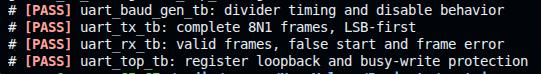
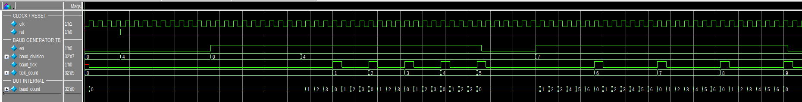
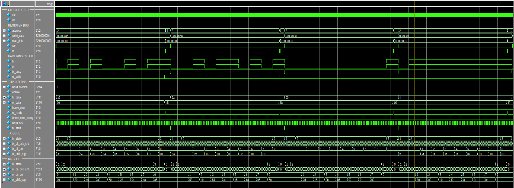
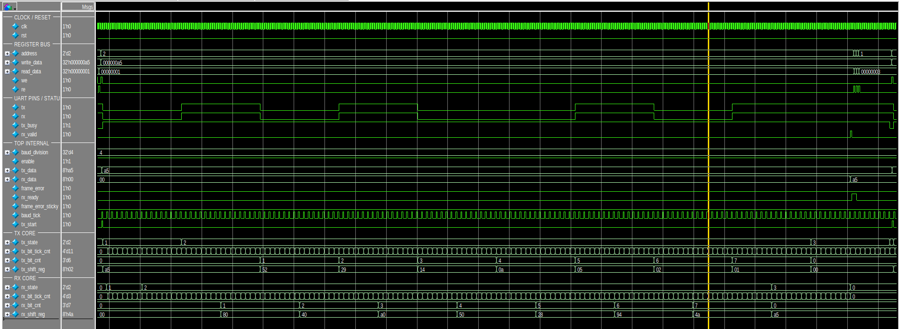
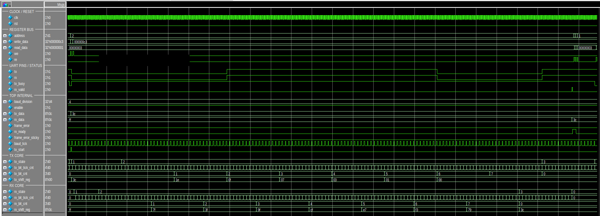
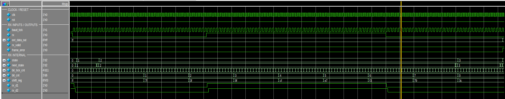

# UART Simulation and Verification

This document presents the simulation strategy, self-checking test suite, and
waveform analysis for the educational UART 8N1 RTL core. The goal is to verify
the protocol behavior at module level and again through the register-controlled
top-level integration.

The primary simulation flow uses QuestaSim. The Verilog testbenches are also
compatible with Icarus Verilog, while the synthesizable RTL has been checked
with Verilator lint.

## Verification Scope

The verified UART configuration is intentionally focused:

| Property | Configuration |
|---|---|
| Frame format | 8N1 |
| Data width | 8 bits |
| Bit order | Least-significant bit first |
| Parity | None |
| Stop bits | 1 |
| Idle level | Logic HIGH |
| RX synchronization | Two flip-flops |
| TX/RX timing | 16x oversampling tick |

The serial frame is:

```text
Idle(1) | Start(0) | D0 D1 D2 D3 D4 D5 D6 D7 | Stop(1)
```

For a 16x oversampling clock, the programmable divider is:

```text
baud_division = clock_frequency / (baud_rate * 16)
```

The testbenches use small divider values to keep simulation time short. This
changes only the simulated bit duration; the 16-tick-per-bit UART behavior is
unchanged.

## Verification Architecture

The suite verifies each module independently before exercising the integrated
top-level loopback:

```text
uart_baud_gen_tb  --->  baud tick timing and enable behavior
uart_tx_tb        --->  start/data/stop serialization
uart_rx_tb        --->  reception, false-start rejection, frame errors
uart_top_tb       --->  register interface and TX-to-RX loopback
```

The top-level physical loopback is:

```text
register write -> uart_tx -> tx pin -> rx pin -> uart_rx -> register read
```

Every testbench is self-checking and includes:

- Directed stimulus with explicit expected results.
- `$fatal` on a failed assertion.
- A simulation watchdog timeout.
- A `[PASS]` marker on successful completion.

The Makefile checks the PASS marker, so compilation errors, functional
failures, and timeouts return a non-zero exit code to the shell.

## Test Matrix

| Testbench | Cases covered | Expected result |
|---|---|---|
| [`uart_baud_gen_tb`](../testbench/uart_baud_gen_tb.v) | Disabled generator, zero divider, divider 4, divider 7, phase restart | Correct tick spacing; no tick while disabled |
| [`uart_tx_tb`](../testbench/uart_tx_tb.v) | `0xA5`, `0x00`, `0xFF` | Complete 8N1 frames, LSB-first, correct `tx_busy` and idle return |
| [`uart_rx_tb`](../testbench/uart_rx_tb.v) | False start, valid `0xA5/00/FF`, invalid stop bit on `0x3C` | Valid bytes accepted; false start rejected; frame error detected |
| [`uart_top_tb`](../testbench/uart_top_tb.v) | Disabled TX write, baud/status readback, loopback `0xA5/5A/00/FF`, busy write `0x3C/C3` | Correct register behavior, received data, sticky status, and busy-write protection |

## Test-Pattern Rationale

The directed data patterns are chosen to expose specific UART behaviors rather
than provide only arbitrary test values:

- `0xA5` and `0x5A` provide alternating bit patterns that reveal bit-order or
  shift-direction errors.
- `0x00` verifies a complete all-LOW data field between the start and stop bits.
- `0xFF` verifies an all-HIGH data field while distinguishing data bits from
  the LOW start bit.
- `0x3C/0xC3` distinguishes the active TX frame from a rejected write during
  `tx_busy`.
- A LOW stop bit verifies framing-error detection and confirms that an invalid
  frame does not assert `rx_valid`.

## Running the Simulation

### Requirements

The following QuestaSim commands must be available in `PATH`:

```sh
vlib
vlog
vsim
```

Check the installation with:

```sh
vlog -version
vsim -version
```

### Verified Tools

The project has been checked with:

- QuestaSim for the primary simulation and waveform flow.
- Icarus Verilog for an additional self-checking simulation run.
- Verilator for RTL lint checking.
- GNU Make for repeatable simulation commands.

### Complete self-checking suite

From the project root:

```sh
cd sim
make test
```

Successful execution produces a PASS result for every self-checking testbench:



All four testbenches complete without assertion failures or watchdog timeouts.
The Makefile stops immediately and returns a non-zero exit code if any test
does not reach its PASS condition.

### Individual testbench

```sh
cd sim
make TB=uart_baud_gen_tb
make TB=uart_tx_tb
make TB=uart_rx_tb
make TB=uart_top_tb
```

Running `make` without a `TB` override executes `uart_baud_gen_tb`.

### Waveform GUI

```sh
cd sim
make wave TB=uart_top_tb
```

The same command can open any testbench:

```sh
make wave TB=uart_baud_gen_tb
make wave TB=uart_tx_tb
make wave TB=uart_rx_tb
```

[`wave.do`](../sim/wave.do) groups the register bus, UART pins, status flags,
FSM states, counters, and shift registers for inspection.

### Clean generated files

```sh
cd sim
make clean
```

The clean target removes the QuestaSim work library, logs, and waveform
databases. Generated simulation files are excluded by `.gitignore`.

## Waveform Analysis

### 1. Baud-generator timing



The baud-generator test covers four behaviors in one directed sequence:

1. With `en=0`, the counter is held at zero and no tick is produced.
2. With `baud_division=0`, tick generation remains disabled even when `en=1`.
3. With divider 4, `baud_count` advances from 0 to 3 and produces one
   single-clock `baud_tick` every four system clocks.
4. After disabling and restarting with divider 7, the phase restarts from zero
   and one tick is produced every seven system clocks.

This verifies both the divider interval and deterministic restart behavior.

### 2. Top-level loopback overview



The overview contains four clean register-driven loopback frames:

```text
0xA5 -> 0x5A -> 0x00 -> 0xFF
```

For every transfer:

- A write to `TX_DATA` creates a one-clock `tx_start` pulse.
- `tx_busy` remains HIGH for the complete start/data/stop frame.
- The serial `tx` and `rx` signals match because the testbench connects them
  directly.
- The receiver asserts `rx_valid` after checking the stop bit.
- `rx_data` updates to the transmitted byte.
- Sticky `rx_ready` asserts until the testbench reads `RX_DATA`.
- `frame_error` and `frame_error_sticky` remain LOW.

The numerical FSM encoding shown in the waveform is:

| Value | State |
|---:|---|
| 0 | IDLE |
| 1 | START |
| 2 | DATA |
| 3 | STOP |

The RX state transitions occur slightly after TX because the asynchronous RX
input passes through a two-flop synchronizer before start-bit detection.

### 3. Detailed `0xA5` frame



`0xA5` is `1010_0101` in binary. UART transmits the least-significant bit
first, so the serial data order is:

```text
Idle | Start | D0 D1 D2 D3 D4 D5 D6 D7 | Stop
  1  |   0   |  1  0  1  0  0  1  0  1 |  1
```

The TX shift register demonstrates right-shift serialization:

```text
A5 -> 52 -> 29 -> 14 -> 0A -> 05 -> 02 -> 01 -> 00
```

The RX shift register reconstructs the same byte from the serial samples:

```text
00 -> 80 -> 40 -> A0 -> 50 -> 28 -> 94 -> 4A -> A5
```

After the stop bit is validated, `rx_valid` pulses and `rx_data` becomes
`0xA5`. The top-level `rx_ready` flag then remains available to software until
the RX-data register is read.

### 4. Busy-write protection



This directed test starts a valid `0x3C` transmission and then attempts to
write `0xC3` while `tx_busy=1`.

The waveform shows that:

- The register bus presents `write_data=0xC3` during the busy period.
- The active internal `tx_data` remains `0x3C`.
- The TX shift register continues serializing `0x3C` without corruption.
- The loopback receiver reconstructs `0x3C` and raises `rx_valid`.
- No frame error is generated.

This confirms that software cannot overwrite an in-progress TX frame.

### 5. RX frame-error detection



The RX negative test drives `0x3C` with a LOW stop bit. The receiver still
samples all eight data bits, but the stop-bit check fails. Consequently:

- `frame_error` pulses for one system-clock cycle.
- `rx_valid` remains LOW, so the invalid frame is not reported as valid data.
- The FSM returns from STOP toward IDLE/recovery.

This test separates data reconstruction from frame acceptance: a byte is valid
only after its stop bit has been verified.

## Top-Level Status Semantics

The top-level status register exposes four low-order bits:

| Bit | Name | Behavior |
|---:|---|---|
| 0 | `enable` | Enables the UART |
| 1 | `tx_busy` | HIGH while a TX frame is active |
| 2 | `rx_ready` | Sticky after a valid RX frame; cleared by reading `RX_DATA` |
| 3 | `frame_error_sticky` | Sticky after a framing error; cleared by reading status |

The loopback and busy-write tests exercise these semantics through the simple
register interface rather than relying only on internal hierarchical checks.

## Result Summary

The directed simulation suite verifies the intended educational UART scope:

- Correct 8N1 serialization and LSB-first bit order.
- Sixteen oversampling ticks per UART bit.
- Mid-frame TX data stability.
- RX start-bit validation and synchronized input handling.
- Valid-byte indication and stop-bit error detection.
- Register-driven TX/RX operation and sticky status behavior.
- End-to-end loopback across the integrated top level.
- Non-zero process status for failed or timed-out tests.

All current self-checking testbenches pass in the verified simulation flow.

## Deliberate Project Limits

This repository is an educational UART protocol implementation, not a
production peripheral. To keep the design focused and readable, it implements
fixed 8N1 framing without parity, FIFOs, configurable stop bits, majority-vote
sampling, or a standard APB/AXI bus. These are natural future extensions, but
they are outside the verification scope documented here.
